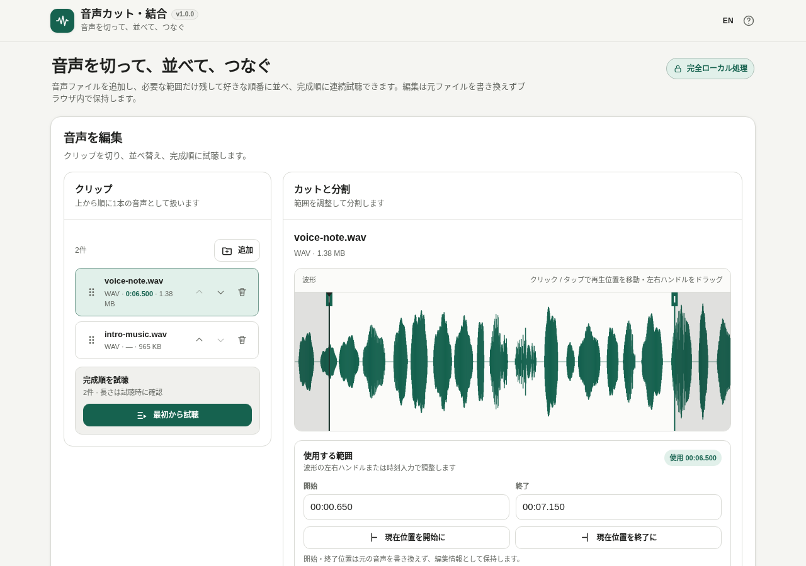

# 音声カット・結合

[](https://github.com/ttomohisa/htmlapps-audio-cutter-joiner/actions/workflows/deploy-pages.yml)
[](LICENSE)
[](https://ttomohisa.github.io/htmlapps-audio-cutter-joiner/)

[English README](README.md)

複数の音声ファイルをブラウザ内でカット・分割・並べ替えし、完成順に試聴して1つの音声として保存する、プライバシー重視の単一HTMLアプリです。選択した音声ファイルをサーバーへアップロードしません。

## 🚀 デモ

### [GitHub Pagesで音声カット・結合を開く](https://ttomohisa.github.io/htmlapps-audio-cutter-joiner/)

GitHub Pagesへのアクセス時には最初のHTMLを取得します。読み込み後の波形解析、編集、試聴、書き出しは端末内で処理し、選択した音声ファイルをアプリから外部へ送信しません。

[](https://ttomohisa.github.io/htmlapps-audio-cutter-joiner/)

## 主な機能

- **波形を見ながらカット** — 左右のハンドル、時刻入力、現在の再生位置から使用範囲を調整できます。
- **分割して並べ替え** — 再生位置で分割し、ドラッグまたは上下ボタンでクリップ順を変更できます。
- **書き出し前に確認** — 完成順の連続試聴と、隣り合うクリップのつなぎ目試聴ができます。
- **よく使う編集を元に戻す** — 直前のトリム、分割、削除、並べ替えを1段Undoできます。
- **ローカルで書き出し** — MP3 / WAVに保存でき、ブラウザがWebCodecs AACエンコードに対応している場合はM4A/AACも選べます。
- **完全ローカル・単一HTML** — MP3エンコーダーをビルド時に内包し、実行時外部通信を遮断。日本語 / 英語UIを収録しています。

## すぐに使う

### Webデモを使う

[デモを開く](https://ttomohisa.github.io/htmlapps-audio-cutter-joiner/)だけで使えます。インストールやアカウント登録は不要です。

### 単一HTMLを使う

1. このリポジトリの [audio-cutter-joiner.html](https://github.com/ttomohisa/htmlapps-audio-cutter-joiner/blob/main/audio-cutter-joiner.html) をダウンロードします。
2. 現行ブラウザで開きます。
3. 音声ファイルを追加して、そのまま端末内で編集します。

### 完全オフライン用にビルドする（上級者向け）

1. このリポジトリをダウンロードまたはcloneします。
2. Windowsで`build-standalone.bat`をダブルクリックします。
3. 初回は`dependencies.json` / `dependencies.lock.json`で固定した`lamejs`正本を取得します。
4. SHA-256一致を確認した場合だけHTMLへ内包します。
5. 生成された`dist/index.html`を任意の場所へコピーすれば、以後はネット接続なしで単体起動できます。

WindowsでのビルドにPython、Node.js、ローカルWebサーバーは不要です。

## 使い方

1. ファイル選択またはPCのDrag & Dropで音声を1件以上追加します。
2. クリップを選択して波形を表示します。
3. 波形ハンドルまたは時刻入力で開始・終了を調整します。
4. 必要なら再生位置を決めて**ここで分割**します。
5. クリップを並べ替え、不要なクリップを削除します。
6. **完成順を試聴**または**つなぎ目を試聴**で確認します。
7. **書き出し**を開き、MP3 / M4A / WAV、ファイル名、必要に応じてビットレートを選び、生成した音声を保存します。

### キーボードショートカット

| キー | 動作 |
| --- | --- |
| `Space` | 選択中クリップを再生 / 一時停止 |
| `←` | 5秒戻る |
| `→` | 5秒進む |

## 対応形式

### 入力

入力デコードはブラウザのメディア対応状況を利用します。MP3、M4A/AAC、WAV、OGG、Opus、WebMなどが利用できますが、実際の対応形式はブラウザ・OSによって異なります。

### 出力

| 形式 | 出力 | 補足 |
| --- | --- | --- |
| MP3 | 44.1 kHz ステレオ、128 / 192 / 256 / 320 kbps | 内包した`lamejs`でローカルエンコード |
| WAV | 44.1 kHz ステレオ、PCM 16-bit | ブラウザ内で直接生成 |
| M4A/AAC | 44.1 kHz ステレオ、128 / 192 / 256 / 320 kbps | WebCodecsがAAC (`mp4a.40.2`) エンコードに対応している場合のみ有効 |

M4A/AACが利用できないブラウザではM4A書き出しを無効化し、MP3またはWAVを案内します。

## GitHub Pagesで公開する

このリポジトリには、完全埋め込みHTMLを再ビルドして`dist/`をGitHub Pagesへ公開するworkflowが含まれています。

1. `htmlapps-audio-cutter-joiner`としてGitHubへpushします。
2. **Settings → Pages → Build and deployment → Source**で**GitHub Actions**を選びます。
3. `main`へpushするか、Actionsから**Deploy GitHub Pages**を手動実行します。
4. 成功すると`https://ttomohisa.github.io/htmlapps-audio-cutter-joiner/`で公開されます。

`main`へのpushでは`scripts/check-repository.ps1`が実行され、固定依存からstandaloneを再生成し、実行時通信ガードを検証してから`dist/`を公開します。

## 開発・ビルド構成

```text
.
├─ src/index.template.html       # 編集対象のアプリ本体
├─ app.config.json               # アプリ情報・バージョン
├─ dependencies.json             # ビルド時依存の固定情報
├─ dependencies.lock.json        # レビュー済みSHA-256
├─ build-standalone.bat          # Windowsビルド入口
├─ build-standalone.ps1          # 単一HTMLビルダー
├─ audio-cutter-joiner.html      # 生成済み単一HTML配布物
├─ dist/index.html               # Pages / オフライン配布物
└─ .github/workflows/
   ├─ build-standalone.yml       # ビルド検証
   ├─ validate.yml               # リポジトリ検証
   └─ deploy-pages.yml           # GitHub Pages公開
```

### MP3エンコーダーを更新する

`lamejs`は不変のupstream commitへ固定しています。更新時は新しいソースを確認したうえで、`dependencies.json`のversion / URLと`dependencies.lock.json`のSHA-256をセットで更新してください。

キャッシュを捨てて固定ソースを取り直す場合:

```bat
build-standalone.bat -ForceDownload
```

ビルドでは自動的に次を行います。

- キャッシュがない場合だけ固定MP3エンコーダーを取得
- SHA-256一致を確認してから内包
- build placeholderの残存を拒否
- CSPと実行時ネットワークAPIを検証
- dependency / self-extract / size reportのmanifestを生成
- self-extract HTMLを生成し、復元したpayloadが`dist/index.html`とbyte単位で一致することを確認

## プライバシーと実行時通信

生成HTMLのContent Security Policyには`connect-src 'none'`を含めています。アプリ本体は実行時に`fetch`、XMLHttpRequest、WebSocket、EventSourceを使用しません。ランタイムCDN、analytics、telemetry、外部フォントもありません。

選択した音声はローカルの`File`として保持します。波形解析・書き出し時のデコードもブラウザ内で行います。縮約した波形ピークはキャッシュしますが、デコードした`AudioBuffer`は必要な処理後に保持し続けない設計です。

ローカルキャッシュが空の場合、**ビルド時だけ**固定した`lamejs` URLへアクセスする場合があります。これは完成アプリの実行時通信とは別です。

リリース確認手順は[VERIFY_OFFLINE.md](VERIFY_OFFLINE.md)を参照してください。

## 制限事項

- 読み込み可能な音声コーデックはブラウザ・OSに依存します。
- ブラウザに互換性のあるWebCodecs AACエンコーダーがない場合、M4A/AAC書き出しは利用できません。
- 現在の書き出しは、元ファイルのサンプルレートやチャンネル構成にかかわらず44.1 kHzステレオへ変換します。
- 長時間・高ビットレートの音声では、波形解析や書き出し時のクリップデコードに大きなメモリを使う場合があります。
- Undoは直前のトリム、分割、削除、並べ替えの1操作のみです。
- マルチトラックDAWではありません。ミックス、録音、エフェクト、メタデータ編集は対象外です。

## 依存ライブラリ

| ライブラリ | バージョン | ライセンス | 用途 |
| --- | ---: | --- | --- |
| lamejs | 1.2.1 | LGPL-3.0 | ローカルMP3エンコード |

アプリ本体はMIT Licenseです。内包する`lamejs`はLGPL-3.0のまま利用します。詳細は[THIRD_PARTY_NOTICES.md](THIRD_PARTY_NOTICES.md)と`licenses/LGPL-3.0.txt`を参照してください。

## Contributing

不具合報告・機能提案はGitHub Issuesで歓迎します。機能提案は[APP_SPEC.md](APP_SPEC.md)に記載した、シンプルな単一シーケンスのカット・結合ツールという範囲を基準にしてください。

## License

Copyright © 2026 ttomohisa

アプリ本体は[MIT License](LICENSE)です。第三者コンポーネントのライセンスは[THIRD_PARTY_NOTICES.md](THIRD_PARTY_NOTICES.md)に記載しています。
