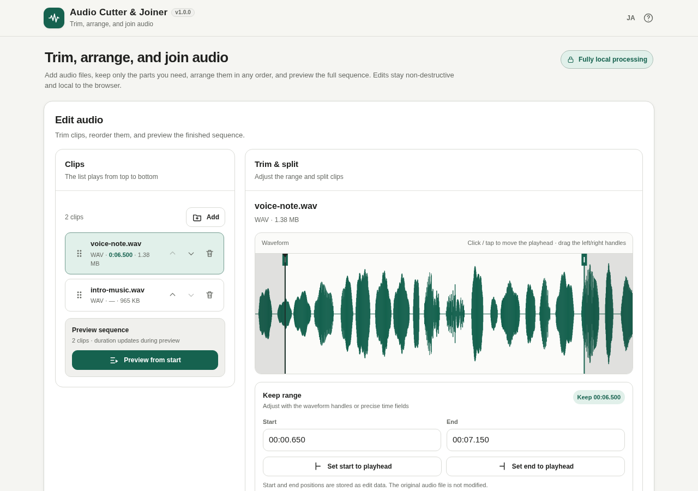

# Audio Cutter & Joiner

[](https://github.com/ttomohisa/htmlapps-audio-cutter-joiner/actions/workflows/deploy-pages.yml)
[](LICENSE)
[](https://ttomohisa.github.io/htmlapps-audio-cutter-joiner/)

[日本語版 README](README.ja.md)

A privacy-focused, single-HTML audio cutter and joiner for trimming, splitting, reordering, previewing, and exporting multiple audio clips without uploading selected files to a server.

## 🚀 Live demo

### [Open Audio Cutter & Joiner on GitHub Pages](https://ttomohisa.github.io/htmlapps-audio-cutter-joiner/)

GitHub Pages delivers the initial HTML. After it loads, waveform analysis, editing, preview, and export are processed locally on your device. The audio files you select are not uploaded by the app.

[](https://ttomohisa.github.io/htmlapps-audio-cutter-joiner/)

## Features

- **Trim with a waveform** — Adjust the kept range with draggable handles, precise time fields, or the current playhead.
- **Split and arrange clips** — Split at the playhead, remove clips, and reorder them by drag-and-drop or explicit Up / Down controls.
- **Preview before exporting** — Play the full sequence in order or preview the boundary between neighboring clips.
- **Undo common edits** — Restore the last trim, split, delete, or reorder operation with one-step Undo.
- **Export locally** — Save the current sequence as MP3 or WAV; M4A/AAC is available when the browser supports AAC encoding through WebCodecs.
- **Private, single-HTML operation** — The MP3 encoder is embedded at build time, runtime network connections are blocked, and Japanese/English UI is included.

## Quick start

### Use the web demo

Just [open the demo](https://ttomohisa.github.io/htmlapps-audio-cutter-joiner/). No installation or account is required.

### Use the download file

1. Download [audio-cutter-joiner.html](https://github.com/ttomohisa/htmlapps-audio-cutter-joiner/blob/main/audio-cutter-joiner.html) from this repository.
2. Open it in a current browser.
3. Add audio files and edit them locally.

### Use it fully offline (advanced)

1. Download or clone this repository.
2. Double-click `build-standalone.bat` on Windows.
3. The first build downloads the exact `lamejs` source pinned in `dependencies.json` / `dependencies.lock.json`.
4. The SHA-256 is verified before the encoder is embedded.
5. Copy the generated `dist/index.html` wherever you need it and open that single file later without an internet connection.

Python, Node.js, and a local web server are not required for the Windows build.

## Usage

1. Add one or more audio files with the picker or desktop Drag & Drop.
2. Select a clip to display its waveform.
3. Adjust Start / End with the waveform handles or precise time fields.
4. Move the playhead and use **Split here** when one source should become multiple clips.
5. Reorder or remove clips until the sequence matches the desired output.
6. Use **Preview sequence** or **Preview junction** to check the result.
7. Open **Export**, choose MP3 / M4A / WAV, enter a filename and bitrate when applicable, then save the generated file.

### Keyboard shortcuts

| Shortcut | Action |
| --- | --- |
| `Space` | Play / pause the selected clip |
| `←` | Seek back 5 seconds |
| `→` | Seek forward 5 seconds |

## Format support

### Input

Input decoding uses the browser's media support. Common files such as MP3, M4A/AAC, WAV, OGG, Opus, and WebM may work, but exact support varies by browser and operating system.

### Output

| Format | Output | Notes |
| --- | --- | --- |
| MP3 | 44.1 kHz stereo, 128 / 192 / 256 / 320 kbps | Encoded locally with the embedded `lamejs` encoder |
| WAV | 44.1 kHz stereo, PCM 16-bit | Written directly in the browser |
| M4A/AAC | 44.1 kHz stereo, 128 / 192 / 256 / 320 kbps | Enabled only when WebCodecs reports AAC (`mp4a.40.2`) encoder support |

When M4A/AAC is unavailable, M4A export is disabled and the UI asks the user to select MP3 or WAV instead.

## Publish with GitHub Pages

The repository includes a workflow that rebuilds the fully embedded HTML and deploys `dist/` to GitHub Pages.

1. Push the repository to GitHub as `htmlapps-audio-cutter-joiner`.
2. Open **Settings → Pages → Build and deployment → Source** and select **GitHub Actions**.
3. Push to `main`, or manually run **Deploy GitHub Pages** from the Actions tab.
4. After a successful deployment, the demo is available at `https://ttomohisa.github.io/htmlapps-audio-cutter-joiner/`.

Each push to `main` runs `scripts/check-repository.ps1`, rebuilds the standalone files from the pinned dependency, verifies the runtime-network guardrails, and publishes the generated `dist/` directory.

## Development and build layout

```text
.
├─ src/index.template.html       # Editable application source
├─ app.config.json               # Application metadata and version
├─ dependencies.json             # Pinned build-time dependency metadata
├─ dependencies.lock.json        # Reviewed SHA-256 lock
├─ build-standalone.bat          # Windows build entry point
├─ build-standalone.ps1          # Standalone HTML builder
├─ audio-cutter-joiner.html      # Generated single-HTML distribution
├─ dist/index.html               # Generated Pages/offline artifact
└─ .github/workflows/
   ├─ build-standalone.yml       # Build validation
   ├─ validate.yml               # Repository validation
   └─ deploy-pages.yml           # GitHub Pages deployment
```

### Update the MP3 encoder dependency

`lamejs` is intentionally pinned to an immutable upstream commit. When updating it, review the new source first, then update the version/URL and SHA-256 together in `dependencies.json` and `dependencies.lock.json`.

To discard the local build cache and download the pinned source again:

```bat
build-standalone.bat -ForceDownload
```

The build process automatically:

- Downloads the pinned MP3 encoder only when it is not already cached
- Verifies the source SHA-256 before embedding it
- Embeds the encoder into the generated HTML
- Rejects unresolved build placeholders
- Verifies the CSP and blocks runtime network APIs
- Generates dependency, self-extract, and size-report manifests
- Generates a self-extracting HTML and verifies that its restored payload matches `dist/index.html` byte-for-byte

## Privacy and runtime network protection

The generated HTML includes a Content Security Policy containing `connect-src 'none'`. The application source does not use runtime `fetch`, XMLHttpRequest, WebSocket, or EventSource. There is no runtime CDN, analytics, telemetry, or remote font dependency.

Selected audio is kept as local `File` objects. Waveform analysis and export decoding use browser APIs locally. Reduced waveform peaks are cached, while decoded `AudioBuffer` data is released after the relevant operation where possible.

The build step may access the pinned `lamejs` URL when the local cache is empty. That build-time download is separate from application runtime.

See [VERIFY_OFFLINE.md](VERIFY_OFFLINE.md) for the release verification procedure.

## Limitations

- Input codec support depends on the browser and operating system.
- M4A/AAC export is unavailable when the browser does not expose a compatible WebCodecs AAC encoder.
- Export currently renders to 44.1 kHz stereo, even when the source uses a different sample rate or channel layout.
- Very long or high-bitrate source files can require substantial memory while a clip is being decoded for waveform analysis or export.
- Undo restores only the most recent trim, split, delete, or reorder operation.
- This is a single-sequence cutter/joiner, not a multitrack DAW; mixing, recording, effects, and metadata editing are intentionally out of scope.

## Dependencies

| Library | Version | License | Purpose |
| --- | ---: | --- | --- |
| lamejs | 1.2.1 | LGPL-3.0 | Local MP3 encoding |

The application code is MIT-licensed. The embedded `lamejs` component remains under LGPL-3.0; see [THIRD_PARTY_NOTICES.md](THIRD_PARTY_NOTICES.md) and `licenses/LGPL-3.0.txt`.

## Contributing

Bug reports and feature proposals are welcome through GitHub Issues. Please keep proposals aligned with the focused single-sequence cutter/joiner scope described in [APP_SPEC.md](APP_SPEC.md).

## License

Copyright © 2026 ttomohisa

Application code is licensed under the [MIT License](LICENSE). Third-party components retain their own licenses as described in [THIRD_PARTY_NOTICES.md](THIRD_PARTY_NOTICES.md).

## Reset trim and current exports

- **Reset trim** restores the selected clip's original kept boundaries. A split fragment resets only within that fragment, without restoring audio outside it. The reset supports one-step Undo and does not change the source file or waveform data.
- The control is disabled while the clip's range is unknown or already fully restored.
- Adding audio, resetting trim, and undoing edits clear the previous export. Editing during an export cancels that attempt; export again to save the current sequence. Rejected imports and no-op edits keep a valid export.

### Automated audio regressions

Run `node --test tests/audio-editing.test.cjs` with Node.js 18+ for source-level checks, or run `scripts/check-repository.ps1` for the build plus checks against source, root HTML, standalone HTML, and the restored self-extract payload. Tests use synthetic AudioBuffer-compatible samples and DOM/media doubles, and inspect real WAV bytes. They do not replace browser layout, native decoder/encoder, listening, offline, or saved-file reopening checks.
